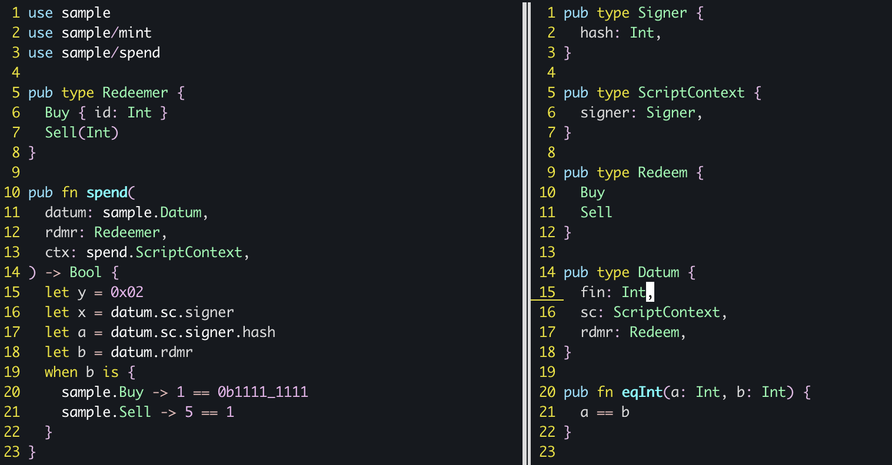

# Aiken Vim

A plugin for working with [Aiken](https://github.com/txpipe/aiken) on Vim / NeoVim.

## Features

- [x] Syntax Highlighting
- [x] Automatic indentation

## Installation

### vim-plug

Simply use:

```vim
Plug 'CardanoSolutions/aiken-vim'
```

### Manual

Copy the content of `ftdetect`, `indent` and `syntax` to your `$HOME/.config/nvim/`.
Make sure that `:syntax` is `on`.

## Preview



## License

[MPL-2.0](./LICENSE)
